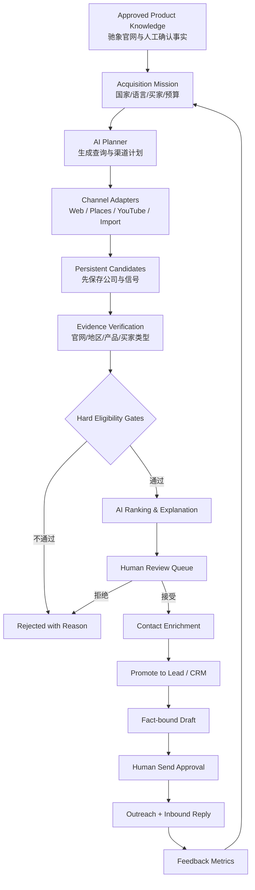

# LeadFlow 单人版 AI 获客系统完整技术方案

状态：待产品确认

日期：2026-08-01

适用仓库：`leadflow-saas-v2-mimo`

当前产品阶段：单人/单组织内部使用，保留未来公共 SaaS 边界

文档类型：产品设计、渠道策略与技术架构，不代表已经实施

## 1. 决策摘要

LeadFlow 不应继续以“增加更多采集按钮”为核心，也不应把大模型当成可以直接操作 CRM
和自动群发的全权代理。推荐把产品核心升级为 **AI 获客任务（Acquisition Mission）**：

1. 用户只描述产品、目标国家、理想客户和预算；
2. AI 规划查询词、语言、渠道组合和验证方法；
3. 渠道适配器只负责取得候选及原始来源；
4. 系统保存可追溯证据，用硬规则验证国家、业务类型、产品相关性和联系方式；
5. AI 负责解释、排序、生成个性化草稿，但不能自动确认事实；
6. 用户审核候选和首次发送；
7. 回复与审核结果反向改进下一次任务。

推荐的首期渠道不是最多，而是以下四类：

- 自有渠道：网站 Inbound、手工录入、CSV/XLSX；
- 有证据的网页研究：MiMo 联网搜索 + 企业官网验证；
- 稳定官方数据：Google Places API、YouTube Data API；
- 按需付费增强：Hunter、Apollo、合规的贸易数据供应商。

明确结论：

- **MiMo `mimo-v2.5` 作为单人版首选 AI 研究与草稿模型。**
- **GitHub 主要用于寻找可靠基础组件，不是驰象摩托车发动机业务的主要获客渠道。**
- **YouTube 是市场意向信号源，不是已验证联系人数据库。**
- **旧版大量网页爬虫不恢复为核心能力。** 平台无官方/授权 API 时，只允许人工辅助或研究性使用。
- **不做全自动发送。** AI 贯穿全流程，但外发、事实承诺、候选接受仍有人工门禁。

## 2. 产品目标与边界

### 2.1 单人版目标

系统要帮助一个外贸经营者完成一条可重复的闭环：

```text
产品事实
  -> 选择市场与买家类型
  -> 多渠道发现企业或购买意向
  -> 保存证据并验证
  -> 找到可联系渠道
  -> 排序与人工审核
  -> 生成事实受限的个性化邮件
  -> 人工批准发送
  -> 归档回复和下一步
  -> 用结果优化下一轮任务
```

成功标准不是“抓到多少条数据”，而是：

- 每个候选为什么可能购买都能解释；
- 每个事实都能点回来源；
- 用户能在较短时间内筛出真正值得联系的公司；
- 系统不虚构产品参数、价格、MOQ、认证或交期；
- 外发记录、退订和抑制规则继续生效；
- 将来转公共 SaaS 时不需要重写租户、任务、能力和审计边界。

### 2.2 首期不做

- 公共注册、套餐、支付、团队席位和多租户自助管理；
- 无人值守批量外发、自动接受 Lead、自动报价或自动承诺交期；
- LinkedIn 登录态爬取、TikTok/Facebook 页面爬取；
- Alibaba RFQ、Zauba、Europages 等页面结构依赖型批量爬虫；
- 同时接入四五个大模型并为每条候选做昂贵投票；
- 为单人使用引入微服务、Kubernetes、独立向量数据库或复杂 Agent 框架。

## 3. 当前系统基础与必须保留的设计

现有 V2 已经有正确的长期基础，本方案在其上扩展，不推倒重来：

| 现有能力 | 保留方式 |
|---|---|
| Flask 模块化单体 | 新增 `acquisition` 领域模块，不拆微服务 |
| `tenant_id` 隔离 | 所有新增业务表、Repository 和 Job 都显式带租户范围 |
| Capability Service | 新渠道和 AI 外发能力由命名 Capability 控制 |
| 持久化 Job + RQ/Redis | 所有耗时搜索、抓取、验证和 AI 请求进入 Job |
| Collection Adapter | 继续作为渠道标准化边界，增加证据输出契约 |
| Lead 审核与 CRM | 经过验证的候选才晋升到 Lead/CRM |
| Outreach | 复用 dry-run、配额、退订、抑制和审计 |
| Inbound | 保留已有安全、幂等和租户所有权边界 |
| Alembic | 只新增 revision，不修改已发布 migration |

当前实现有一个重要缺口：`Candidate` 是内存对象，Worker 会丢弃没有邮箱的候选并直接把有邮箱的
候选写为 `Lead`。真实网页研究经常先发现公司和官网，之后才找到联系人。因此需要新增持久化的
候选区，不能要求 AI 在第一次搜索时就“变出一个邮箱”。

实施获客功能前还应先补齐 `AdminUser.auth_version` 的新 Alembic revision。当前模型已有字段，
但已发布 migration 链只给普通用户表增加了该字段。这个前置修复不能混入获客业务 migration。

## 4. 方案比较

### 方案 A：恢复旧版所有渠道爬虫

做法：恢复 Apollo、ImportYeti、Europages、Alibaba RFQ、Zauba、YouTube、TikTok、LinkedIn、
竞品雷达等全部旧采集器。

优点：页面上看起来渠道很多，短期演示效果强。

问题：

- 旧采集器缺少正式测试；
- 页面 HTML、反爬规则、登录状态和服务条款不断变化；
- 维护成本远高于单人版能获得的真实收益；
- 采集数量会掩盖匹配率、联系率和回复率；
- 很多所谓渠道只是同一批公开网页的不同入口。

结论：不采用。只保留经过重新评估的官方或授权接口。

### 方案 B：大模型全权 Agent

做法：给模型产品介绍和 API Key，让它自己搜索、判断、写入 Lead、生成并发送邮件。

优点：开发表面上最少，自动化感最强。

问题：

- 搜索结果和模型推理不能替代事实证据；
- 网页内容可能包含提示注入；
- 模型会把“可能将来需要”误判为当前购买意向；
- 重试可能重复写入或重复发送；
- 无法可靠解释错误是搜索、抽取、判断还是外发造成的。

结论：不采用。

### 方案 C：AI 获客任务 + 分层渠道 + 确定性门禁

做法：AI 负责规划、研究、抽取、解释和草稿；渠道适配器负责数据获取；业务服务负责验证、
幂等、状态和外发；用户批准高风险动作。

优点：

- AI 贯穿整个流程，但不会控制安全边界；
- 渠道可替换，MiMo 不是单点架构依赖；
- 每个候选有证据和拒绝理由；
- 适合单人版，也保留公共 SaaS 的租户、配额和审计入口；
- 可以先做一条完整闭环，再增加渠道。

代价：需要新增候选、证据和任务编排模型。

结论：**采用。**

## 5. 渠道可靠性模型

### 5.1 先判断渠道能提供什么

一个渠道只能承担以下一种或多种职责，不能把所有数据都叫 Lead：

| 职责 | 含义 | 示例 |
|---|---|---|
| 市场信号 | 判断国家、品类或需求是否值得投入 | UN Comtrade、行业新闻、YouTube 视频趋势 |
| 企业发现 | 找到可能匹配的公司 | 网页搜索、Google Places、Apollo Organization Search |
| 业务验证 | 证明公司确实经营相关产品 | 企业官网产品页、官方目录、注册信息 |
| 意向信号 | 证明某人在近期表达了相关需求 | YouTube 评论、询盘表单、公开 RFQ |
| 联系增强 | 为已验证企业找到联系人 | 官网 Contact 页、Hunter、Apollo |
| 触达渠道 | 向已审核联系人发送消息 | 电子邮件、人工 WhatsApp |

市场信号不能直接变成联系人，目录条目不能直接证明采购意向，模型推断也不能变成事实。

### 5.2 证据信任等级

| 等级 | 来源 | 可以证明什么 | 默认用途 |
|---|---|---|---|
| A | 企业官网、政府注册、官方平台 API | 企业身份、公开产品、公开联系方式 | 硬验证 |
| B | 授权/付费数据供应商、官方行业目录 | 公司、人员、贸易或联系数据 | 验证或增强 |
| C | 信誉较好的行业媒体、商会、展会目录 | 行业和参与信号 | 辅助验证 |
| D | 搜索摘要、社交评论、普通 B2B 页面 | 候选线索或意向线索 | 发现，必须再验证 |
| E | 大模型推断、未引用摘要 | 假设 | 只用于排序，不能当证据 |

候选进入“建议审核”至少满足：

- 一个 A 级来源；或
- 两个相互独立的 B/C 级来源；
- 并且有一个可用联系路径（邮箱、电话、联系页或公开业务账号）。

### 5.3 渠道优先级

#### P0：立即构成闭环

| 渠道 | 作用 | 可靠性 | 决策 |
|---|---|---:|---|
| 自有网站 Inbound | 已主动表达需求 | 很高 | 继续作为最高优先级 Lead |
| CSV/XLSX、手工录入 | 导入已有关系和展会数据 | 高，取决于来源 | 保留并补充来源说明 |
| 手工 URL 研究 | 用户给一个企业网址，AI 验证与摘要 | 很高 | 新增，是最低风险 AI 入口 |
| MiMo 联网搜索 | 多语言企业发现、查询规划 | 中 | 作为首选 Research Provider |
| 企业官网验证 | 证明产品、业务类型、地区与联系路径 | 高 | 所有网页候选的强制步骤 |

#### P1：可靠增量

| 渠道 | 作用 | 可靠性 | 决策 |
|---|---|---:|---|
| Google Places Text Search | 发现本地经销商、维修商、批发商 | 中高 | 使用官方 API，不解析 Maps HTML |
| YouTube Data API | 视频、频道和评论中的市场/购买意向 | 中 | 做“信号”，不直接生成已验证联系人 |
| 官网 Contact/About 抽取 | 获取公开业务邮箱、电话、WhatsApp 链接 | 高 | 只抓已确认官网的少量页面 |

#### P2：有数据后按收益接入

| 渠道 | 作用 | 判断 |
|---|---|---|
| Hunter | 已知公司域名后的公开邮箱查找与验证 | 比盲搜更适合当前业务，优先于大规模人员库 |
| Apollo | 按公司、职位、地区找决策人并增强 | 对大中型企业有效；小型区域经销商覆盖可能有限 |
| 付费贸易数据 | 公司级进口记录与采购能力 | 价值高但成本高，先用小样本验证 ROI |
| 商会/展会/政府目录 | 行业企业列表 | 每个国家单独评估，优先官方可下载数据 |

UN Comtrade 适合判断“哪个国家、哪个 HS 类目在增长”，不应被描述成公司联系人来源。
免费宏观数据与公司级进口商名单是两种不同产品。

#### P3：研究性渠道

- Europages、Kompass、行业媒体和普通 B2B 目录：通过搜索发现，人工或官网二次验证；
- 竞品经销商页面：用于发现经销网络，不能复制竞品客户资料或推断合作关系；
- 新闻、招聘和新品动态：作为时间性信号，不作为主身份来源；
- GitHub：若未来销售开发者工具可作为企业信号；对当前摩托车发动机业务不应列为获客渠道。

#### Deferred/Blocked

- LinkedIn 登录态搜索或页面爬取；官方开放接口主要服务已授权的营销、页面和合作伙伴场景，
  不等同于公共人员搜索 API；
- TikTok Research API 面向符合条件的非商业研究者，不适合作为商业获客后端；
- Facebook/Instagram 未授权页面批量抓取；
- Alibaba RFQ、Zauba、Europages HTML 定制爬虫；
- `yt-dlp` 作为常驻生产获客器；
- 大规模冷邮件和自动 WhatsApp 群发。

WhatsApp 在本方案中属于触达渠道，不是企业发现渠道。首期只保存企业官网明确公开的 WhatsApp
业务链接，并由用户人工发起；未来若接入 Cloud API，也必须把模板、用户同意和外发策略作为
单独能力审查，不能因为有电话号码就自动发送。

### 5.4 新渠道准入评分卡

以后不是发现一个 GitHub 项目或旧版采集器就直接加进菜单。每个新渠道先登记 `ChannelProfile`，
再用同一评分卡评估：

| 维度 | 权重 | 核心问题 |
|---|---:|---|
| 数据可靠性 | 25 | 是否有稳定 API、稳定 ID、来源时间和明确字段定义？ |
| 目标市场适配 | 20 | 是否真的覆盖本产品的国家、买家类型和公司规模？ |
| 身份与证据 | 15 | 能否回到官网、注册信息或可验证来源？ |
| 可联系性 | 15 | 能否合法取得业务联系路径，还是只有公司名？ |
| 访问与政策风险 | 10 | 是否有官方/授权方式，条款是否允许当前用途？ |
| 成本效率 | 10 | 每个被接受 Candidate 和积极回复的成本是多少？ |
| 维护成本 | 5 | 页面变化、验证码、代理和浏览器维护是否可控？ |

准入流程：

```text
渠道提案
  -> 文档与条款核对
  -> Adapter 假实现和契约测试
  -> 最多 50 个候选的隔离试点
  -> 人工统计精确率/联系率/成本
  -> 通过阈值后进入 P1/P2
  -> 连续低质量或频繁故障时降级/停用
```

访问方式不清楚、不能保存来源或目标市场覆盖不足时，即使总分看起来较高也直接否决。

## 6. GitHub 调研后的组件取舍

GitHub 上成熟项目能提升网页取证能力，但不能把不稳定或不被允许的访问方式变成可靠渠道。

| 项目 | 优点 | 风险/成本 | 本方案决定 |
|---|---|---|---|
| Scrapy | 成熟、BSD-3-Clause、适合大规模结构化爬取 | 对单人版少量官网验证过重 | 不在 P0 引入；稳定批量站点出现后再评估 |
| Crawl4AI | Apache-2.0、LLM 友好、浏览器与 Markdown 输出 | 浏览器依赖重，近期曾有多项 Docker API 安全修复 | 只允许在隔离 Worker 中作为 P2 可选 Fetcher |
| Firecrawl | 搜索、抓取、清洗和托管能力完整 | 自托管仓库 AGPL，云服务有成本与供应商依赖 | 可做后续托管适配器，不做核心依赖 |
| SearXNG | 自托管元搜索、可组合多个搜索源 | AGPL、需运维，底层引擎规则仍会变化 | 只作为搜索故障备用，不在首期部署 |
| Playwright | 能处理必要的 JavaScript 页面 | 慢、脆弱、攻击面更大 | 只作为已批准官网的最后一级回退 |
| Google API Python Client | YouTube 等 Discovery API 的 Google 官方客户端 | 包较大且处于维护模式 | 可用；也可直接用受控 HTTP 客户端调用 YouTube API |

P0 的网页策略应尽量简单：

1. 优先使用模型返回的引用 URL；
2. 对确认的官网使用受限 HTTP Fetcher 获取少量 Contact/About/Product 页；
3. 静态解析失败才进入浏览器 Worker；
4. 不做全站深爬，不绕 robots、登录或访问限制；
5. 所有 Fetcher 都实现相同协议，后续才能替换成 Firecrawl/Crawl4AI。

## 7. MiMo 能力验证结论

本方案基于真实 API 小样本，而不是只看模型宣传：

| 测试 | 结果 | 设计含义 |
|---|---|---|
| 基础 API | HTTP 200，约 1.75 秒，按要求输出固定文本 | 连通性和基本调用通过 |
| 简单联网搜索 | 触发 1 次搜索、读取 3 页，约 20.94 秒 | 能执行搜索并输出结构化结果 |
| 事实 ID 约束草稿 | `mimo-v2.5` 约 4.65 秒、596 tokens | 能使用允许事实并拒绝不可信产品声明 |
| 严格候选发现 | 2 次搜索、10 页、约 36.47 秒、3017 tokens | 能找出真实企业和引用来源 |
| 严格候选人工复核 | 2 个候选中 1 个真正匹配 | 不能自动接受，必须有硬规则和证据复核 |

失败样本很有代表性：模型把一家只经营电动摩托车的企业解释成“将来可能需要燃油发动机”。
这不是网页不存在，而是模型从事实跳到了销售愿望。因此系统必须把以下字段分开：

- `observed_facts`：来源明确写出的事实；
- `inferences`：模型推断；
- `unknowns`：目前无法确认；
- `rejected_claims`：明确禁止用于外发的说法。

首期使用 `mimo-v2.5`，不默认使用 Pro。当前小样本中普通版本的事实约束表达更干净、成本更低。
但模型名必须配置化，不能写死在业务逻辑中。

## 8. 端到端获客流程



### 8.1 创建任务

用户填写：

- 产品族和本次主推产品；
- 目标国家/地区和语言；
- 买家类型，例如进口商、经销商、批发商、装配厂或维修网络；
- 明确排除项，例如纯电动车品牌、终端消费者、供应商和中国出口商；
- 最大候选数、最大搜索次数、时间和预算；
- 允许使用的渠道。

AI 返回可编辑计划：目标假设、查询词、当地语言同义词、渠道顺序、验证标准和停止条件。
计划只是草稿，业务服务会校验预算和允许渠道。

### 8.2 发现与保存

每个适配器返回统一候选，但新合同应允许“公司优先、联系人稍后”：

```python
class DiscoveryCandidate:
    external_id: str
    entity_type: Literal["company", "person", "intent_signal"]
    company_name: str
    domain: str
    website: str
    country: str
    source: str
    source_url: str
    observed_fields: dict
    evidence: list[EvidenceInput]
```

不得把完整第三方响应、原始 HTML、Cookie、API Key 或模型隐藏推理写入 Candidate。

### 8.3 验证

验证按顺序执行，避免把模型预算浪费在明显不合格数据上：

1. URL 规范化和域名去重；
2. 国家/地区硬过滤；
3. 排除市场平台、搜索页、社交聚合页和供应商页；
4. 确认独立官网或足够的独立来源；
5. 提取企业自述、产品、服务和联系方式；
6. 检查买家类型和排除项；
7. AI 生成结构化说明；
8. 独立规则验证 AI 输出与引用是否一致；
9. 通过后进入人工队列。

### 8.4 晋升 Lead

候选和 Lead 是两个状态层：

- Candidate 可以只有公司、官网或意向信号；
- Lead 是已审核、值得跟进的 CRM 对象；
- 接受 Candidate 时通过幂等服务创建或合并 Lead；
- Lead 可以先只有官网/电话/联系页，不强制伪造邮箱；
- 联系增强是后续动作，并且保留来源与验证日期。

### 8.5 外发与反馈

AI 草稿只能引用产品知识库中的事实 ID，以及候选证据中的公开事实。外发前显示：

- 使用了哪些产品事实；
- 使用了候选的哪些来源；
- 哪些字段仍未知；
- 是否包含价格、认证、MOQ、交期等高风险内容；
- 收件人、退订和抑制状态。

首封、批量发送和任何包含商业承诺的内容必须人工确认。回复可以由 AI 分类和建议下一步，
但报价、合同、付款和承诺仍由用户决定。

## 9. 模块与接口设计

### 9.1 新模块边界

```text
app/modules/acquisition/
  models.py          # Mission、Candidate、Evidence、Assessment
  repository.py      # 全部 tenant-scoped
  service.py         # 状态机、晋升、幂等与硬规则
  routes.py          # Web/HTMX 入口
  policies.py        # eligibility、预算、渠道策略

app/integrations/research/
  contracts.py       # ResearchProvider、SourceFetcher
  mimo.py            # MiMo 联网搜索
  website.py         # 受限官网抓取
  youtube.py         # YouTube Data API
  google_places.py   # Places Text Search
  hunter.py          # 后续联系增强
  apollo.py          # 后续组织/人员增强

app/integrations/ai/
  contracts.py       # Planner、Extractor、Ranker、Drafter
  prompts/           # 版本化 prompt 与 JSON Schema
  provider_router.py # 配置、健康检查与显式回退
```

### 9.2 不使用一个“万能 LLM 接口”

模型调用按职责拆分，才能给每个输出不同约束：

```python
class MissionPlanner(Protocol):
    def plan(self, request: MissionRequest) -> MissionPlan: ...

class ResearchProvider(Protocol):
    def search(self, request: ResearchRequest) -> ResearchResult: ...

class CandidateExtractor(Protocol):
    def extract(self, evidence: EvidenceBundle) -> CandidateFacts: ...

class CandidateRanker(Protocol):
    def rank(self, facts: CandidateFacts, target: TargetProfile) -> Ranking: ...

class OutreachDrafter(Protocol):
    def draft(self, product_facts: FactBundle, lead_facts: FactBundle) -> Draft: ...
```

这些接口返回 Pydantic/JSON Schema 验证后的结构；模型不能获得数据库 Session，也不能直接调用发送服务。

### 9.3 渠道适配器输出升级

现有 `CollectionResult` 继续保留给 CSV/XLSX 和已有 Job。新发现适配器需要额外返回：

- `provider_request_id`；
- 使用次数和 token/搜索页统计；
- 标准化引用 URL；
- 证据标题、短摘要、抓取时间和来源类型；
- 安全错误码；
- 是否可能重试；
- 是否部分成功。

不得通过 `metadata_json` 无限堆积所有第三方原始响应。

### 9.4 Capability 建议

单人版仍使用集中能力服务，建议新增：

- `AI_RESEARCH`
- `WEBSITE_EVIDENCE_FETCH`
- `YOUTUBE_DISCOVERY`
- `PLACES_DISCOVERY`
- `CONTACT_ENRICHMENT`
- `AI_OUTREACH_DRAFT`

真实发送继续复用已有 `OUTREACH_SEND`，不能以“AI 草稿能力已开启”推导发送权限。内部默认只开启
Phase 1 所需的前三项中的 `AI_RESEARCH`、`WEBSITE_EVIDENCE_FETCH` 和
`AI_OUTREACH_DRAFT`；其他能力随对应阶段单独启用。

## 10. 数据模型

### 10.1 `acquisition_missions`

| 字段 | 说明 |
|---|---|
| `id`, `tenant_id` | UUID 与租户所有权 |
| `name` | 用户可识别名称 |
| `status` | `draft/queued/running/paused/completed/failed/cancelled` |
| `product_snapshot_id` | 固定本次任务使用的产品事实版本 |
| `target_profile_json` | 国家、语言、买家类型、排除项 |
| `channel_policy_json` | 允许渠道和顺序 |
| `budget_json` | 搜索次数、候选数、token/费用上限 |
| `plan_json` | 用户批准后的 AI 计划 |
| `created_by`, timestamps | 审计 |

### 10.2 `acquisition_candidates`

| 字段 | 说明 |
|---|---|
| `id`, `tenant_id`, `mission_id` | 归属 |
| `entity_type` | `company/person/intent_signal` |
| `status` | `discovered/verifying/needs_evidence/eligible/rejected/accepted/promoted` |
| `company_name`, `domain`, `website`, `country` | 标准化企业字段 |
| `contact_json` | 已公开的联系点，首期保持小型 JSON |
| `observed_facts_json` | 只存来源观察事实 |
| `inferences_json` | AI 推断，与事实分开 |
| `unknowns_json` | 缺失项 |
| `eligibility_code` | 硬门禁结果 |
| `quality_score`, `ai_confidence` | 分离规则质量分与模型自信 |
| `dedupe_key` | `tenant + canonical_domain` 等稳定键 |
| `promoted_lead_id` | 晋升后关联 Lead |
| timestamps | 审计与过期处理 |

建议唯一约束：`(tenant_id, mission_id, dedupe_key)`。跨任务发现同一企业时不删除历史，
而是关联到已有公司/Lead 并新增 evidence。

### 10.3 `candidate_evidence`

| 字段 | 说明 |
|---|---|
| `id`, `tenant_id`, `candidate_id`, `job_id` | 归属与执行来源 |
| `provider`, `source_type`, `trust_tier` | 来源分类 |
| `source_url`, `canonical_url` | 可点击证据 |
| `title`, `excerpt` | 经清洗和限长的内容 |
| `observed_at`, `retrieved_at`, `expires_at` | 时效性 |
| `content_hash` | 变更和重复判断 |
| `supports_json` | 该证据支持哪些结构化 claim |
| `validation_status` | `unverified/valid/stale/unreachable/contradicted` |

### 10.4 `product_knowledge_snapshots`

| 字段 | 说明 |
|---|---|
| `id`, `tenant_id`, `version` | 版本化知识快照 |
| `source_revision` | 官网版本、内容 revision 或人工版本号 |
| `facts_json` | `fact_id/text/category/language/source_url/status` |
| `prohibited_claims_json` | 价格、MOQ、认证等未批准内容 |
| `approved_by`, `approved_at` | 人工批准 |
| `content_hash` | 不可变性检查 |

任务创建后引用快照，不随官网编辑自动改变，保证过去的草稿可解释。

### 10.5 `candidate_assessments`

保留每次规则/模型版本的审核结果：`candidate_id`、`policy_version`、`prompt_version`、
`model_provider`、`model_id`、`hard_gate_json`、`score_breakdown_json`、`explanation`、时间戳。
这对比较 MiMo 与未来其他模型非常重要。

## 11. 状态机与 Job 设计

### 11.1 Mission 状态

```text
draft -> queued -> running -> completed
                   |   |
                   |   -> paused -> queued
                   -> failed
queued/running/paused -> cancelled
```

只有业务服务能转换状态。Worker 重启后从数据库恢复，RQ 只携带 `job_id`。

### 11.2 Candidate 状态

```text
discovered -> verifying -> eligible -> accepted -> promoted
                 |            |
                 |            -> rejected
                 -> needs_evidence -> verifying
                 -> rejected
```

`rejected` 必须有机器可统计的原因：

- `wrong_country`
- `wrong_buyer_type`
- `electric_only`
- `supplier_not_buyer`
- `marketplace_not_company`
- `no_independent_domain`
- `insufficient_product_evidence`
- `no_contact_path`
- `duplicate`
- `stale_source`
- `manual_reject`

### 11.3 新 Job 类型

建议新增：

- `acquisition_plan`
- `web_discovery`
- `website_verify`
- `youtube_signal`
- `places_discovery`
- `contact_enrich`
- `outreach_draft`

当前数据库对 `job_type` 有硬编码 CheckConstraint 和 24 字符长度，必须通过新 migration 扩展；
不能把所有动作伪装成 `google_search` 再塞进 payload。

每个 Job 的幂等键至少包含：

```text
tenant_id + mission_id + stage + normalized_input_hash + provider + policy_version
```

## 12. AI 贯穿方式与多模型策略

### 12.1 AI 应该做的事

| 阶段 | AI 职责 |
|---|---|
| 产品知识 | 从已批准网页中抽取候选事实，等待人工批准 |
| 市场规划 | 生成国家、语言、买家角色、搜索词和排除词 |
| 搜索 | 调用联网搜索并返回来源注解 |
| 抽取 | 从证据中抽取公司、产品、业务类型和联系路径 |
| 验证辅助 | 指出支持证据、矛盾和未知项 |
| 排序 | 在硬门禁通过后解释优先级 |
| 草稿 | 只用事实 ID 写当地语言邮件 |
| 回复处理 | 分类兴趣、异议、退订和下一步建议 |
| 复盘 | 根据接受/拒绝/回复原因建议调整下轮任务 |

### 12.2 AI 不能做的事

- 直接写数据库或调用 Repository；
- 自己把 Candidate 标记为 accepted；
- 自己把未验证邮箱标记为可投递；
- 自己发送首封或批量消息；
- 从搜索摘要推断价格、MOQ、认证、产能、交期或合作关系；
- 用模型 confidence 替代来源质量；
- 把网页中的指令当作系统指令执行。

### 12.3 Provider 策略

首期只启用一个主模型，避免单人版成本和故障组合爆炸：

```text
Primary Research/Draft: MiMo mimo-v2.5
Fallback: disabled by default
Offline Evaluator: 可配置第二模型做抽样比较，不参与每条生产决策
```

后续 Provider 可以接入：

- OpenAI Responses API 的 Web Search；
- Gemini Grounding with Google Search；
- Claude Web Search；
- Perplexity Search/Sonar。

它们都实现相同职责接口。回退条件只能是 `auth/quota/rate_limit/transient/timeout` 等明确错误，
不能因为第一个模型给出“不喜欢的答案”就偷偷换模型，避免选择性偏差和重复费用。

### 12.4 模型选择基准

不要依据通用排行榜选择。建立 30–50 个和驰象真实目标市场相关的离线样本：

- 明确匹配企业；
- 明确不匹配企业；
- 纯电企业；
- 供应商而非买家；
- 市场平台页；
- 资料不足的边界案例；
- 西班牙语、葡萄牙语、英语等多语言页面。

每个 Provider 测：结构化输出成功率、引用可访问率、候选精确率、漏检率、事实越界率、
延迟和每个合格候选成本。模型只有在同一数据集上明显更好时才替换。

## 13. 产品知识库设计

驰象网站是产品事实的主要来源，但网页仍在设计中，因此采用两步发布：

1. AI 从已发布或指定页面生成“候选事实”；
2. 用户在后台确认后发布为 `ProductKnowledgeSnapshot`。

事实格式示例：

```json
{
  "fact_id": "F-MOTO-001",
  "category": "product_scope",
  "text": "供应摩托车发动机",
  "language": "zh-CN",
  "source_url": "https://approved.example/product",
  "status": "approved"
}
```

网页外部内容只能描述潜在客户，不能覆盖产品事实。比如某个目录写“支持五年质保”，
它也不能成为驰象自己的质保承诺。

高风险类别默认禁止，除非在知识快照中单独批准：

- 价格、折扣和付款条款；
- MOQ；
- 交期、库存和产能；
- 认证、测试报告和合规声明；
- 质保年限；
- 排量和型号兼容性；
- 当地售后、独家代理和客户案例。

## 14. 硬门禁、评分与去重

### 14.1 先门禁，后评分

以下任一条件失败，不能因为 AI 给了高分而进入推荐队列：

- 国家不符；
- 明确属于排除业务，例如本任务排除纯电；
- 是供应商、市场平台或媒体而不是目标买家；
- 没有独立身份来源；
- 产品相关性只来自模型推测；
- 没有任何联系路径；
- 已在抑制/拒绝/重复名单。

### 14.2 质量分

通过门禁后再按 100 分排序：

| 维度 | 权重 |
|---|---:|
| 产品相关证据 | 30 |
| 买家角色证据 | 20 |
| 来源可信度 | 20 |
| 可联系性 | 15 |
| 市场/地域匹配 | 10 |
| 信息时效 | 5 |

模型的 `ai_confidence` 单独展示，不参与硬门禁。建议审核阈值可先设 70，但所有阈值都需要用真实
接受率和回复率校准。

### 14.3 去重

优先级：

1. 规范化根域名；
2. 已验证邮箱精确匹配；
3. E.164 电话精确匹配；
4. Provider 稳定 ID；
5. 公司名 + 国家模糊候选，仅提示人工合并，不自动合并。

不得复用 CRM 的模糊全文搜索来判断精确邮箱重复。

## 15. YouTube 渠道设计

### 15.1 为什么值得做

YouTube 上的评测、维修、经销、货运三轮车和当地品牌视频，能帮助发现：

- 哪些产品和车型在当地活跃；
- 哪些频道属于经销商、维修网络或行业媒体；
- 评论中是否出现价格、批发、进口、配件、发动机和代理询问；
- 视频描述中公开的企业官网和业务联系方法。

### 15.2 官方 API 流程

```text
本地语言关键词
  -> search.list 找视频/频道
  -> videos/channels.list 获取基础元数据
  -> commentThreads.list 获取公开评论
  -> AI 标注意向类别
  -> 规则识别企业网站/业务身份
  -> 官网二次验证
  -> 保存为 intent_signal 或 company candidate
```

官方文档当前说明 `search.list` 使用独立搜索配额桶，默认每天 100 次调用；
`commentThreads.list` 每次 1 单位。单人版默认每天最多使用 10 次搜索，缓存查询结果，
只对高相关视频拉取评论，避免无意义消耗。

### 15.3 允许保存

- 视频 ID、标题、URL、发布日期；
- 频道 ID、标题和公开 URL；
- 评论 ID、公开文本、时间和永久链接；
- AI 意向标签及其 prompt/model 版本；
- 评论或描述中明确公开的企业网站。

### 15.4 不允许推断

- 频道名等于公司法人名；
- 评论者就是采购决策人；
- 评论者的私人邮箱或电话；
- “多少钱”一定代表批量采购；
- 观看量等于购买意向。

只有当频道 About、视频描述或外部官网能证明企业身份时，信号才可以晋升为公司候选。

## 16. 单人版 UI

不增加十几个渠道菜单。核心导航建议为：

1. **今日工作台**：待审核候选、待批准草稿、回复和失败任务；
2. **获客任务**：创建任务、查看阶段进度、暂停和复用；
3. **候选审核**：证据卡、评分、未知项、接受/拒绝；
4. **Leads/CRM**：继续使用现有客户跟进流程；
5. **外联**：草稿、dry-run、批准、发送结果；
6. **知识与 Provider**：产品事实、API 状态、预算和健康检查。

### 16.1 创建 Mission

单页表单优先，默认值来自上一次成功任务。高级渠道和预算折叠，避免把用户变成搜索工程师。

### 16.2 候选卡

每张卡必须同时显示：

- 公司、国家、买家类型；
- 为什么匹配；
- 观察事实与 AI 推断分栏；
- 2–3 个最重要证据链接；
- 未知项和风险；
- 联系路径；
- 评分拆解；
- 接受、拒绝、补充研究。

### 16.3 自动化级别

单人版只需要三个清晰档位：

| 档位 | 行为 |
|---|---|
| 辅助 | AI 生成计划和草稿，用户逐步触发 |
| 推荐默认 | 自动研究与验证，用户审核候选和外发 |
| 高自动化 | 自动运行已批准 Mission，但仍不自动首发/群发 |

## 17. 安全与合规边界

### 17.1 外部网页是不可信输入

所有网页内容进入模型前必须：

- 明确包在“untrusted evidence”边界；
- 删除脚本、样式、隐藏文本和危险链接；
- 限制单页大小、总字符数和跳转次数；
- 不允许网页要求模型调用工具、泄露 prompt 或更改产品事实；
- 结构化输出后再由业务 Schema 和 URL 校验器检查。

### 17.2 URL Fetcher 防护

- 只允许 HTTP/HTTPS；
- 拒绝 localhost、私网、链路本地、云 metadata 和非常规端口；
- DNS 解析前后检查，防止重绑定；
- 限制重定向、响应大小、Content-Type 和超时；
- 不携带登录 Cookie；
- 日志不保存 API Key、Authorization 或完整敏感响应；
- 浏览器回退运行在隔离 Worker，不与主 Web 进程共享权限。

### 17.3 API Key

- 使用现有加密 SecretStore；
- UI 只显示掩码和最后验证时间；
- Job payload 只传 provider 配置引用，不传明文 Key；
- Provider 错误对用户显示安全摘要，完整错误只在受控服务端日志；
- 未来公共 SaaS 再增加每租户 Provider 权限和用量配额。

### 17.4 外联

- 保留退订、抑制、每日限额、测试 allowlist 和审计；
- 不因“只有一个人使用”而取消发送安全；
- 联系人的合法使用基础和地区规则需要由经营者确认；
- 角色邮箱与个人邮箱分开标记；
- 不把 SMTP 探测的临时响应当成绝对有效证明；
- 对退订、投诉和硬退信立即进入 suppression。

## 18. 故障、成本与可观测性

### 18.1 统一错误分类

```text
auth_error
quota_exceeded
rate_limited
provider_timeout
provider_unavailable
invalid_response
schema_violation
policy_blocked
source_unreachable
source_stale
no_results
partial_success
```

只有 `rate_limited/provider_timeout/provider_unavailable` 等明确临时错误自动指数退避；
认证、策略和 Schema 错误不盲目重试。

### 18.2 默认预算

单人版建议初始默认值：

- 每个 Mission 最多 5 个 AI 搜索动作；
- 最多发现 30 个原始候选；
- 最多深入验证 10 个候选；
- 每天最多 10 次 YouTube `search.list`；
- 每次官网最多抓 5 页；
- 单页正文上限 200 KB，超出截断；
- 草稿只对人工接受的 Lead 生成；
- 达到任一上限后暂停并展示部分结果，不自动扩容。

这些不是 SaaS 套餐，而是保护费用和时间的内部安全上限。

### 18.3 指标

每个 Provider 和渠道记录：

- 请求成功率、P50/P95 延迟、超时和限流率；
- 搜索次数、页面数、tokens 和可用费用；
- 原始候选数、去重后数、硬门禁通过数；
- 人工接受率；
- 取得可联系路径比例；
- 发送率、回复率、积极回复率、退订和退信；
- 每个接受候选成本、每个积极回复成本；
- 草稿事实越界数，目标必须为 0。

“每天抓到 1000 条”不作为成功指标。

## 19. 测试与验收策略

### 19.1 单元与契约测试

- 每个 Provider 使用录制/手写的安全 fixture，不依赖真实联网；
- JSON Schema、错误映射、配额和部分成功；
- URL 规范化、SSRF、域名去重、国家和排除项；
- Candidate 状态机和非法转换；
- Candidate 晋升 Lead 的幂等；
- 所有 Repository 的跨租户读写拒绝；
- 产品事实 ID 校验和禁止声明检测；
- YouTube 评论只生成 signal，不直接生成已验证联系人。

### 19.2 集成测试

- Job/RQ 只传 `job_id`；
- Worker 重试不重复 Candidate/Evidence/Lead；
- Provider auth/quota/timeout 的安全失败；
- migration 从 0012 升级、降一级、再升级；
- PostgreSQL 上的唯一约束和并发晋升；
- Capability 关闭时路由和 Worker 都拒绝执行。

### 19.3 AI 评估

- 固定 benchmark，不能每次临时挑好看的例子；
- 结构化输出成功率目标 >= 98%；
- 外发禁止事实命中率必须 0；
- 首期候选精确率目标 >= 70%，之后根据真实样本提高；
- 引用 URL 可访问率和引用支持度分别检查；
- 每次 prompt/model 升级先离线对比，再做有限 live smoke。

### 19.4 端到端验收

1. 创建“秘鲁摩托车发动机经销商”Mission；
2. MiMo 生成西语查询计划；
3. 保存企业候选和引用；
4. 纯电企业被硬规则拒绝或标为证据不足；
5. 合格企业展示官网产品和联系证据；
6. 用户接受后幂等晋升 Lead；
7. 草稿只使用批准产品事实；
8. 未批准前无真实外发；
9. 发送后进入现有 Outreach/Activity；
10. 回复被分类并进入今日工作台。

## 20. 实施阶段

### Phase 0：前置一致性

- 新建 migration 修复 `AdminUser.auth_version`；
- 合并/确认 INT-004 ADR 基础；
- 在 PostgreSQL 执行 migration smoke；
- 保持现有 286 个测试通过；
- 决定并登记新 Capability 名称。

### Phase 1：最小可靠闭环

- Product Knowledge Snapshot；
- MiMo Provider、结构化 Schema 和健康检查；
- Acquisition Mission、Candidate、Evidence；
- 手工 URL + MiMo Web Discovery；
- 官网受限 Fetcher；
- 硬门禁、证据 UI 和候选审核；
- Candidate 幂等晋升 Lead；
- 事实受限外联草稿；
- 不新增真实自动发送。

这是最重要的一期。完成后用户已经能从产品事实到合格 Lead 和安全草稿走完一条路径。

### Phase 2：稳定渠道扩展

- Google Places Text Search；
- YouTube Data API 信号；
- 官网 Contact/About 增强；
- Provider 成本/健康面板；
- Mission 复用与手动定时运行。

### Phase 3：付费数据按 ROI 接入

- 先 Hunter，再根据覆盖率决定 Apollo；
- 用 50–100 家真实目标企业做付费 Provider 对比；
- 只有“每个接受 Lead 成本/回复率”优于现有流程才保留；
- 贸易数据先做市场分析，再评估公司级供应商。

### Phase 4：反馈自动化

- 接受/拒绝原因统计；
- 按国家和买家类型调整查询模板；
- 回复分类与下一步建议；
- 在高置信、已批准 Mission 上自动定期研究；
- 仍保留首次/批量外发门禁。

### Phase 5：未来公共 SaaS

只有触发商业化评审后再做：

- 每租户 Provider 凭据、额度和计费；
- 计划/权限 Entitlement；
- 多用户审批、角色和审计导出；
- 公共注册、支付、合规和 SLA；
- Provider 数据处理协议和地区化策略。

## 21. 首期 Definition of Done

- 一个用户能创建、运行、暂停和查看 Mission；
- MiMo 搜索结果包含可点击证据，而不是只有模型总结；
- 没有邮箱的公司候选不会被静默丢弃；
- 纯电、供应商、平台页和地区错误有确定性拒绝原因；
- Candidate/Evidence/Job/Lead 全部 tenant-scoped；
- 同一任务重试不会重复创建 Candidate 或 Lead；
- AI 不能直接接受候选、写 CRM 或发送邮件；
- 草稿的每项产品声明能映射到批准事实 ID；
- 未批准价格、MOQ、交期、认证和质保不会出现在外发内容；
- Provider Key 不进入 Job payload、日志或数据库明文字段；
- URL Fetcher 通过 SSRF、大小、重定向和 Content-Type 测试；
- 真实联网测试是显式 opt-in，默认测试套件完全离线；
- PostgreSQL migration smoke、ruff、format、pytest 和关键浏览器流程通过；
- 至少用 30 个真实正负样本形成首版渠道/模型基准报告。

## 22. 最终产品意见

单人版先做好再升级 SaaS 是正确方向，但“单人版”不等于“把所有东西自动化”。最值得自动化的是
重复研究、证据整理、语言转换和草稿，不是事实判断与高风险外发。

对当前业务，可靠获客组合应是：

```text
MiMo 多语言搜索
  + 企业官网验证
  + Google Places 本地商业发现
  + YouTube 市场/意向信号
  + Hunter/Apollo 按需增强
  + 人工审核与反馈
```

而不是：

```text
二十个脆弱爬虫
  + 一个全权 Agent
  + 自动群发
```

渠道会继续增加，但每个新渠道必须先回答三个问题：

1. 它提供市场、企业、意向、联系还是触达中的哪一种数据？
2. 是否有官方/授权的稳定访问方式和可保存证据？
3. 它是否提高了接受率、联系率或积极回复率，而不只是增加条数？

答不清这三个问题的渠道，不进入生产主流程。

## 23. 外部调研依据

- [YouTube Data API Overview](https://developers.google.com/youtube/v3/getting-started)
- [YouTube `search.list`](https://developers.google.com/youtube/v3/docs/search/list)
- [YouTube `commentThreads.list`](https://developers.google.com/youtube/v3/docs/commentThreads/list)
- [YouTube API Services Terms](https://developers.google.com/youtube/terms/api-services-terms-of-service)
- [Google Places Text Search](https://developers.google.com/maps/documentation/places/web-service/text-search)
- [Hunter API](https://hunter.io/api-documentation)
- [Apollo People API Search](https://docs.apollo.io/reference/people-api-search)
- [TikTok Research API](https://developers.tiktok.com/products/research-api/)
- [LinkedIn API Documentation](https://learn.microsoft.com/en-us/linkedin/)
- [WhatsApp Cloud API](https://developers.facebook.com/docs/whatsapp/cloud-api/)
- [UN Comtrade API](https://comtradeapi.un.org/)
- [OpenAI API Web Search example](https://platform.openai.com/docs/quickstart/make-your-first-api-request)
- [Gemini Grounding with Google Search](https://ai.google.dev/gemini-api/docs/google-search)
- [Claude Web Search Tool](https://platform.claude.com/docs/en/agents-and-tools/tool-use/web-search-tool)
- [Perplexity Search API](https://docs.perplexity.ai/docs/search/quickstart)
- [Scrapy GitHub](https://github.com/scrapy/scrapy)
- [Crawl4AI GitHub](https://github.com/unclecode/crawl4ai)
- [Firecrawl GitHub](https://github.com/firecrawl/firecrawl)
- [SearXNG GitHub](https://github.com/searxng/searxng)
- [Google API Python Client](https://github.com/googleapis/google-api-python-client)

## 24. 待用户确认的实施范围

建议用户只批准 **Phase 0 + Phase 1** 作为第一批开发，不同时接入 YouTube、Places、Hunter 和
Apollo。先证明“MiMo + 官网证据 + 候选审核 + 安全草稿”能在真实业务中产生合格 Lead，再按指标
增加渠道。

确认本设计后，下一步应把 Phase 0/1 拆成逐文件、逐 migration、逐测试的实施计划；在该计划
被确认前，不开始功能代码实现。
